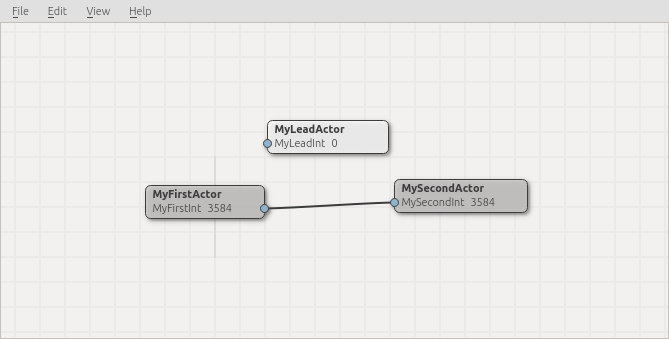

Guide
-----

In this test we will create programs which enable the use of multiple
processors of a computer. You will be provided with a framework and some
tools to create programs for the assignments.

This website provides the descriptions of the assignments as well as a
reference for the framework and tools.

Introduction
############

In the framework we call a small program an 'Actor'. The :py:mod:`sphof`
framework provides different 'Actor' classes. These classes have a 
setup(), update() and draw() method similar to OpenFrameworks and 
Processing.

Additionally to these methods there are methods to enable communication
between the Actors. This communication is done using signals which you
are going to use during the assignments.

In the Actor classes you can register named variables to be used for 
communication with other Actors. I.e. to register an integer:

.. code-block:: python
   :linenos:
   
   class MyFirstActor(Actor):

       def setup(self):
           self.register_int("MyFirstInt", 0, "re")
            
       def update(self):
           self.emit_signal("MyFirstInt", self.get_value("MyFirstInt")+1)

It's important to understand that once an Actor has a variable 
registered every other Actor can access this value. However before
acquiring the value of a variable the Actor interested in the variable
first needs to subscribe to it. This can be accomplished by using the 
signal_subscribe method. I.e:

.. code-block:: python
   :linenos:
   :emphasize-lines: 4

   class MySecondActor(Actor):

       def on_peer_enter(self, peer, name, headers, *args, **kwargs):
           self.signal_subscribe(self.uuid(),  None, peer, "MyFirstInt")

       def on_peer_signaled(self, peer_id, name, signal):
           print(name, signal)
           
By subscribing to the MyFirstInt variable of the MyFirstActor the 
MyFirstActor will send the value of the variable through a signal. Of 
course you first need to be aware of the MyFirstActor, hence the usage 
of the :py:meth:`on_peer_enter <zocp.ZOCP.on_peer_enter>` method. 
Remember as we are running Actors on multiple processors you will never 
know if your program started first or if the other was first. Therefore 
the :py:meth:`on_peer_enter <zocp.ZOCP.on_peer_enter>` method will tell you.

It might also be easier to directly link variables of Actors. You can do 
this by registering a variable and then subscribing this variable to 
another Actor's variable. In the MySecondActor example we can do this as 
follows:

.. code-block:: python
   :linenos:
   :emphasize-lines: 4,7,10

   class MySecondActor(Actor):

       def setup(self):
           self.register_int("MySecondInt", 0, "rs")

       def on_enter_peer(self, peer, name, headers, *args, **kwargs):
           self.signal_subscribe(self.uuid(),  "MySecondInt", peer, "MyFirstInt")

       def update(self):
           print(self.get_value('MySecondInt'))

.. note::
    Notice the difference in the last parameter of the register_int
    method of both classes. In the MyFirstActor class it is 're' and in the
    MySecondActor it is 'rs'. 'r' Means the variable is **r**\ eadable. 's'
    Means the variable is a 'signal **s**\ ensor'. This implies it can
    receive signals. 'e' Means the variable is a 'signal **e**\ mitter'. It 
    means the variable can send signals. Read more about this in the
    :py:meth:`ZOCP reference<zocp.ZOCP.register_int>`.

Starting Actors
###############

We now know how to program Actors and let them communicate with each
other. However, we still need to start them. It's important to know that 
any regular program always has one 'main' thread. Only from the 'main' 
thread you can start other threads in order to utilize multiple 
processors. For the 'main' thread we use the :py:class:`LeadActor <sphof.LeadActor>` 
class which provides us methods for starting more :py:class:`Actor <sphof.Actor>` 
instances. Remember you can only have **one** LeadActor in your program!

For example a simple LeadActor looks like this:

..  code-block:: python
    :linenos:
    
    from sphof import LeadActor
    
    class MyLeadActor(Actor):

        def setup(self):
            self.register_int("MyLeadInt", 0, "rs")
            
        def update(self):
            print(self.get_value("MyLeadInt"))

    app = MyLeadActor('MyLeadActor')
    app.run()

Save this text as 'myapp.py'. You can then run this program as follows:

.. code-block:: bash
    
    $ python3 myapp.py

It will print repeating lines of '0'. You can stop the program by sending
a KeyboardInterrupt. Just press the CTRL-C keyboard combination.

..  note::
    You can also directly execute from Geany however it is important to
    understand this is exactly the same as running from a terminal.

Also notice line 9 where we instantiate the MyLeadActor class and providing
"MyLeadActor" as an argument. Every Actor needs a name. You can provide
the name as a first argument when you instantiate the Actor instance. 
If you don't provide a name a random name will be made up!

Now if we would want to run the MyFirstActor and MySecondActor we can use
the MyLeadActor class as follows:

.. code-block:: python
   :linenos:
   :emphasize-lines: 18,28,29
   
   from sphof import *

   class MyFirstActor(Actor):

       def setup(self):
           self.register_int("MyFirstInt", 0, "re")

       def update(self):
           self.emit_signal("MyFirstInt", self.get_value("MyFirstInt")+1)

   class MySecondActor(Actor):

       def setup(self):
           self.register_int("MySecondInt", 0, "rs")

       def on_peer_enter(self, peer, peer_name, *args, **kwargs):
           if peer_name == "MyFirstActor":
               self.signal_subscribe(self.uuid(),  "MySecondInt", peer, "MyFirstInt")

       def update(self):
           print(self.get_value('MySecondInt'))

   class MyLeadActor(LeadActor):

       def setup(self):
           self.add_actor(MyFirstActor('MyFirstActor'))
           self.add_actor(MySecondActor('MySecondActor'))
           self.register_int("MyLeadInt", 0, "rs")

       def update(self):
           return
           print(self.get_value("MyLeadInt"))

   app = MyLeadActor('MyLeadActor')
   app.run()

..  note:: 
    Line 18 is different from the original MySecondActor. This is 
    because we now run 3 Actors and we only want to subscribe the 
    MyFirstActor to the MySecondActor. Therefore we need to test which
    Actor we are dealing with in the :py:meth:`on_peer_enter <zocp.ZOCP.on_peer_enter>`
    method.

Visualizing and editing Actors
##############################

Ok, we now know how to program Actors and how to run them. Now imagine a
whole lot of them. To be able to oversee how all Actors relate to each 
other we have a visualization tool. On your system you can find the 
ActorEditor. 

Just start the ActorEditor and it will display any Actors you have running. You
can make subscriptions between Actors bij dragging a line between Actor's
emitters and sensors. Emitters are always on the right side of an Actor
representation. Sensors are on the left.

Now make sure you run the LeadActor example we just discussed. The
ActorEditor will display them like in the screenshot. Try to subscribe
the MyFirstActor's MyFirstInt to the LeadActor's LeadInt. You do this by
dragging a line from the emitter to the sensor. This manual action is 
equal to the code:

.. code-block:: python

   self.signal_subscribe(<LeadActor>.uuid(),  "MyLeadInt", <MyFirstActor>.uuid(), "MyFirstInt")

.. note::
   Of course you need to replace <LeadActor> and <MyFirstActor> with 
   the right names in your code
