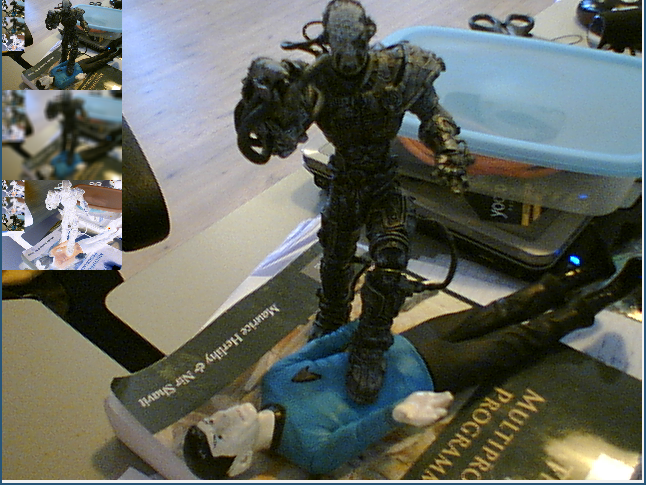

Test 3: It works... most of the time
------------------------------------

In the third test the source of classes is given. You are asked to create
a program similar to the given screenshot below:

As you can see the application captures from a camera, displays this in
a window and also displays three thumbnails of the same video in the 
corner.

Sample classes are given in the example below:

..  code-block:: python

    import sphof
    from sphof import LeadActor, Actor
    import cv2
    import numpy as np

    class OpenCVActor(Actor):

        def setup(self):
            self.register_int("img_in", 0, "rs")
            self.register_int("img_out", 0, "re")
            
        def send_img(self, img, ID):
            """
            Sends the image as a signal to any subscribers using the 'imgID'
            emitter. The canvas is reset after the image is sent!
            """
            imgID = id(img)
            assert(imgID not in sphof.shared_ns)
            sphof.shared_ns[imgID] = img
            self.emit_signal(ID, imgID)
        
        def get_img_from_id(self, imgID):
            """
            Get the image from the given imgID
            """
            return sphof.shared_ns.pop(imgID)
            
        def resize(self, img, width, height):
            return cv2.resize(img, (width, height))
            
        def invert(self, img):
            return 255-img

        def to_hsv(self, img):
            return cv2.cvtColor(img, cv2.COLOR_BGR2HSV)
            
        def blur(self, img):
            kernel = np.ones((5,5),np.float32)/25
            return cv2.filter2D(img,-1,kernel)

        def on_peer_signaled(self, peer, name, data):
            imgID = self.get_value("img_in")
            img = self.get_img_from_id(imgID)
            img_s = self.resize(img, 120, 90)
            self.send_img(img_s, "img_out")

    class CVCapLeadActor(LeadActor):

        def setup(self):
            self.add_actor(OpenCVActor("CVActor"))
            self.video_capture = cv2.VideoCapture(0)
            #self.video_capture.set(cv2.CAP_PROP_FRAME_WIDTH, 320)
            #self.video_capture.set(cv2.CAP_PROP_FRAME_HEIGHT, 240)
            #self.video_capture.set(cv2.CAP_PROP_FPS, 15)
            self.frame = None
            self.thumb = None
            self.register_int("imgID_out", 0, "re")
            self.register_int("thumb_in", 0, "rs")
            cv2.startWindowThread()
            cv2.namedWindow('Video')
            self.cap_success = False
        
        def update(self):
            self.cap_success, self.frame = self.video_capture.read()
            if self.cap_success:
                self.send_img(self.frame, "imgID_out")
        
        def draw(self):
            if self.thumb != None:
                self.frame[0:90, 0:120] = self.thumb
                cv2.imshow('Video', self.frame)
        
        def send_img(self, img, ID):
            """
            Sends the image as a signal to any subscribers using the 'imgID'
            emitter. The canvas is reset after the image is sent!
            """
            imgID = id(img)
            sphof.shared_ns[imgID] = img
            self.emit_signal(ID, imgID)
        
        def on_peer_enter(self, peer, name, headers):
            if name == "CVActor":
                self.signal_subscribe(self.uuid(), "thumb_in", peer, "img_out")
                self.signal_subscribe(peer, "img_in", self.uuid(), "imgID_out")
        
        def on_peer_signaled(self, peer, name, date):
            if name == "CVActor":
                self.thumb = sphof.shared_ns.pop(self.get_value('thumb_in'))

        def stop(self):
            self.video_capture.release()
            cv2.destroyAllWindows()
            super(CVCapLeadActor, self).stop()

    if __name__ == "__main__":
        lead_actor = CVCapLeadActor("CVCaptureActor")
        lead_actor.run()

Now try to create more thumbnails of the video.

.. note::
   What is the difficulty in this program? What are best approaches? It is normal to end up in discussion in this assignment. 
